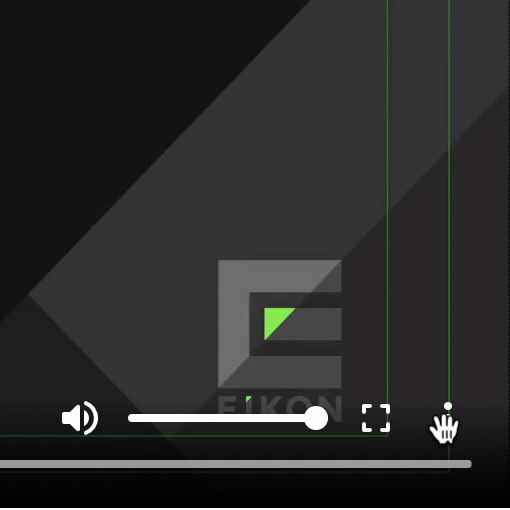

# Run this example

1. Host the files here in a web server. I used nginx in docker, like:

```
docker run --rm -p 8080:80 --name web -v "$PWD":/usr/share/nginx/html nginx:1.19
```

2. Open the page in macos safari, I used safari 14.0.3 (14610.4.3.1.7): http://localhost:8080

3. Look at the text tracks, there is a track labeled "Unrecognized ()". But you can see that no playlists are configured. None in the hls playlsit, none in the player config.

# What I see


